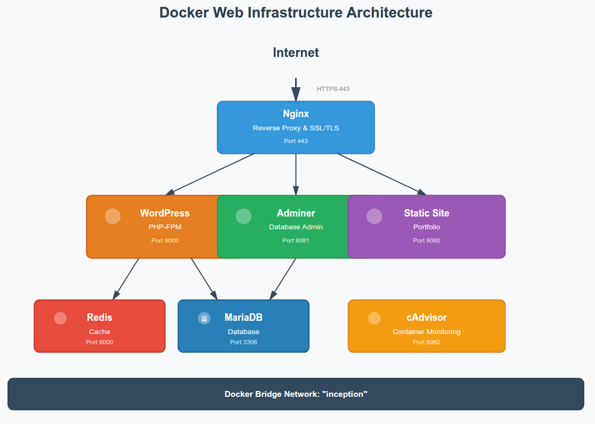
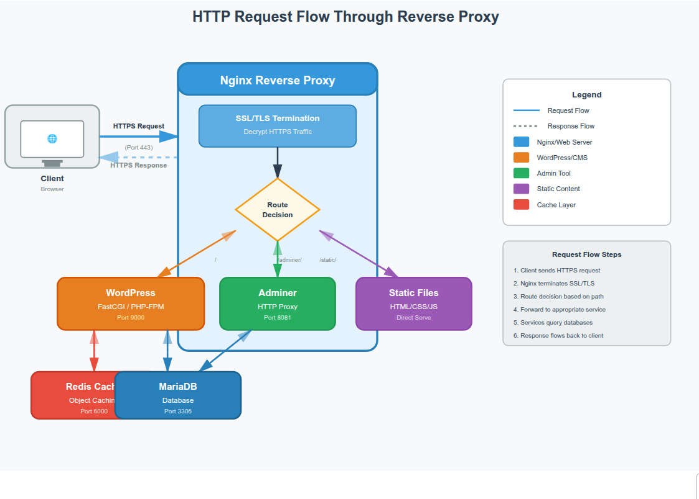

# Inception - Docker Infrastructure

A complete web infrastructure using Docker containers with WordPress, MariaDB, Nginx, Redis, and monitoring tools.



## What This Project Does

This project creates a multi-container Docker application that runs:

- **WordPress** - A fully functional blog/website
- **MariaDB** - Database backend
- **Nginx** - Web server with SSL/TLS encryption
- **Redis** - Caching layer for better performance
- **Adminer** - Web-based database management
- **cAdvisor** - Container monitoring dashboard
- **Static Site** - Simple portfolio page

All services run in isolated Docker containers and communicate through a private network.

## How It Works



### Architecture Overview

1. **Internet traffic** arrives at Nginx on port 443 (HTTPS)
2. **Nginx** acts as a reverse proxy:
   - Routes requests to WordPress for the main site
   - Routes `/adminer/` to the database admin tool
   - Handles SSL/TLS encryption
3. **WordPress** connects to:
   - MariaDB for storing content
   - Redis for caching (faster page loads)
4. **All containers** communicate on an isolated Docker network called "inception"

### Key Features

- **SSL/TLS Encryption** - All traffic is encrypted
- **Reverse Proxy** - Nginx protects backend services
- **Persistent Data** - WordPress and database data survives container restarts
- **Automated Setup** - WordPress installs and configures itself on first run
- **Monitoring** - cAdvisor tracks container resource usage

## Prerequisites

- Docker Engine (20.10+)
- Docker Compose (2.0+)
- Linux system
- 2GB RAM minimum
- 10GB free disk space

## Installation

### 1. Clone the Repository

```bash
git clone <your-repo-url>
cd inception
```

### 2. Configure Environment Variables

Create a `.env` file in the `srcs/` directory:

```bash
# Database
MYSQL_ROOT_PASSWORD=your_secure_root_password
MYSQL_DATABASE=wordpress
MYSQL_USER=wpuser
MYSQL_PASSWORD=your_secure_db_password

# WordPress
WP_URL=https://your-domain.42.fr
WP_TITLE=My WordPress Site
WP_ADMIN_USER=admin
WP_ADMIN_PASS=your_secure_admin_password
WP_ADMIN_EMAIL=admin@example.com
WP_USER=author
WP_USER_EMAIL=author@example.com
WP_USER_PASS=your_secure_user_password
```

### 3. Build and Start

```bash
make
```

This will:
- Create data directories at `/home/$USER/data/`
- Build all Docker images from scratch
- Start all containers

## Usage

### Starting and Stopping

```bash
# Start all services
make up

# Stop all services
make down

# Restart services
make restart

# View running containers
docker ps

# View logs
docker logs wordpress
docker logs nginx
docker logs mariadb
```

### Accessing Services


| WordPress | `https://your-domain.42.fr` 
| Adminer | `https://your-domain.42.fr/adminer/` 
| Static Site | `http://your-domain.42.fr:8080` 
| cAdvisor | `http://your-domain.42.fr:8082` 

### Cleaning Up

```bash
# Stop and remove containers
make clean

# Remove everything including data volumes
make fclean

# Rebuild from scratch
make re
```

## Project Structure

```
inception/
├── Makefile                    # Build commands
├── srcs/
│   ├── .env                   # Environment variables (create this)
│   ├── docker-compose.yml     # Container orchestration
│   └── requirements/
│       ├── mariadb/           # Database container
│       ├── wordpress/         # WordPress + PHP-FPM
│       ├── nginx/             # Web server + SSL
│       └── bonus/
│           ├── redis/         # Cache
│           ├── Adminer/       # DB admin
│           ├── static-site/   # Portfolio
│           └── cadvisor/      # Monitoring
└── docs/
    └── images/                # Architecture diagrams
```

## Data Persistence

Your data is stored on the host machine:

- **WordPress files**: `/home/$USER/data/wordpress`
- **Database files**: `/home/$USER/data/mariadb`

Even if you stop or remove containers, your data remains safe. To completely remove data, use `make fclean`.


### Docker Network

All containers communicate on a bridge network called "inception". This isolates them from other Docker containers and the host network.

### Volume Mounts

- WordPress and Nginx share the `/var/www/html` volume
- MariaDB and WordPress data persist on the host filesystem
- cAdvisor mounts Docker socket for monitoring (read-only)

### Container Dependencies

```
nginx → depends on → wordpress, adminer
wordpress → depends on → mariadb, redis
adminer → depends on → mariadb
```
